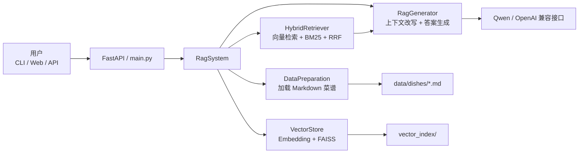

# 菜谱 RAG 智能助手

## 项目简介

这是一个面向中文菜谱场景的 RAG 项目，提供命令行问答、FastAPI 接口和简易 Web 页面。项目基于本地菜谱 Markdown 知识库构建检索增强问答链路，当前默认使用本地 `sentence-transformers` 向量模型与 `FAISS` 索引，并结合大模型生成最终回答。

项目当前知识库来源于 `data/` 目录下的菜谱文档，仓库内已有 350+ 篇中文菜谱，可用于做菜谱问答、做法查询、食材追问和多轮上下文问答。

## 架构图



## 技术栈

- Python 3.11+
- FastAPI + Uvicorn
- LangChain
- FAISS
- rank-bm25
- sentence-transformers
- DashScope / OpenAI 兼容大模型接口
- Docker Compose
- Pytest

## 核心特性

- 中文菜谱知识库问答，支持基于本地 Markdown 文档构建索引
- 混合检索：向量检索与 BM25 并行召回，再用 RRF 重排
- 多轮对话上下文改写，支持“这个菜怎么做”“还要多久”等追问
- 检索结果缓存，减少重复问题带来的检索开销
- 同时提供 CLI、REST API 和浏览器页面三种使用方式
- 支持流式回答接口，适合前端实时展示
- 支持本地 embedding 模式和 API embedding 模式切换

## 如何运行

### 1. 准备 Conda 环境

```powershell
conda create -n cookbook-rag python=3.11 -y
conda activate cookbook-rag
```

### 2. 安装依赖

运行主程序所需依赖：

```powershell
pip install -r requirements.txt -r requirements-local.txt
```

开发和测试依赖：

```powershell
pip install -r requirements-dev.txt
```

### 3. 配置环境变量

复制环境变量模板：

```powershell
Copy-Item .env.example .env
```

最小配置示例：

```env
EMBEDDING_PROVIDER=local
EMBEDDING_MODEL=BAAI/bge-small-zh-v1.5
EMBEDDING_DEVICE=cpu
EMBEDDING_LOCAL_FILES_ONLY=true

QWEN_API_KEY=your_api_key_here
QWEN_BASE_URL=https://dashscope.aliyuncs.com/compatible-mode/v1
LLM_MODEL=qwen3.5-plus
```

说明：

- 默认使用本地 embedding 模型 `BAAI/bge-small-zh-v1.5`
- 默认索引目录为 `vector_index/`
- 如果本地 embedding 需要离线运行，请先准备好 HuggingFace 模型缓存

### 4. 命令行运行

```powershell
python main.py
```

### 5. 启动 Web / API 服务

```powershell
uvicorn api:app --host 0.0.0.0 --port 8000
```

启动后可访问：

- 首页：`http://127.0.0.1:8000/`
- 健康检查：`http://127.0.0.1:8000/health`

### 6. Docker 运行

```powershell
docker compose up -d
```

本地完整构建方式：

```powershell
docker compose -f docker-compose.local.yml up -d --build
```

### 7. 运行测试

```powershell
pytest
```

## 关键设计点

### 1. 文档组织与切块

- 知识库来源于 `data/` 目录下的菜谱 Markdown 文件
- 使用 Markdown 标题结构切块，尽量保留原始菜谱层级
- 每个父文档和子块都带有稳定的 `parent_id`、`chunk_id` 和内容哈希，便于索引兼容性校验

### 2. 检索链路

- 向量检索由 `FAISS` 完成
- 关键词检索由 `BM25` 完成
- 两路结果并行召回后，通过 `RRF` 做融合重排
- 对“汤品”“早餐”“简单”等类别和难度词做 metadata 过滤

### 3. 生成链路

- 先判断用户问题是否依赖上下文
- 对依赖上下文的问题先做查询改写，再执行检索
- 最终回答严格基于召回到的菜谱原文生成，减少幻觉

### 4. 索引与性能

- 首次启动会自动构建本地向量索引
- 后续启动优先复用已有索引，只有文档变化时才重建
- 对重复查询增加了 LRU 风格的检索缓存

### 5. 服务形态

- `main.py` 提供 CLI 交互
- `api.py` 提供 REST 和 SSE 流式接口
- `public/` 提供静态前端页面

## 效果截图 / 接口示例

### Web 访问入口

服务启动后，浏览器打开：

```text
http://127.0.0.1:8000/
```

页面提供：

- 服务状态检查
- 会话 ID 展示与清空
- 示例问题快捷发送
- 流式回答开关

### 健康检查示例

```bash
curl http://127.0.0.1:8000/health
```

返回示例：

```json
{
  "status": "ok",
  "service_ready": true,
  "sessions_total": 0,
  "retrieval_cache_size": 0
}
```

### 普通问答接口示例

```bash
curl -X POST http://127.0.0.1:8000/chat \
  -H "Content-Type: application/json" \
  -d "{\"query\":\"陈皮排骨汤怎么做？\",\"session_id\":\"demo\"}"
```

返回示例：

```json
{
  "answer": "陈皮排骨汤通常需要先处理排骨，再与陈皮一同炖煮，具体可按知识库中的配方步骤操作。",
  "session_id": "demo"
}
```

### 流式问答接口示例

```bash
curl -N -X POST http://127.0.0.1:8000/chat/stream \
  -H "Content-Type: application/json" \
  -d "{\"query\":\"推荐一道简单的早餐\",\"session_id\":\"demo-stream\"}"
```

返回格式为 SSE 事件流，事件类型包含：

- `start`
- `token`
- `end`
- `error`

### 清空会话示例

```bash
curl -X DELETE http://127.0.0.1:8000/sessions/demo
```

## 项目结构

```text
.
├─ api.py                    # FastAPI 服务入口
├─ main.py                   # CLI 入口与系统编排
├─ config.py                 # 配置与环境变量加载
├─ rag/                      # RAG 核心模块
├─ data/                     # 菜谱知识库
├─ public/                   # 前端静态页面
├─ vector_index/             # 本地向量索引
├─ tests/                    # 单元测试
├─ docker-compose.yml
└─ .github/workflows/ci-cd.yml
```

## 部署说明

- 默认部署路径基于本地 CPU embedding
- CI/CD 工作流位于 `.github/workflows/ci-cd.yml`
- 部署细节可查看 `docs/deployment.md`
